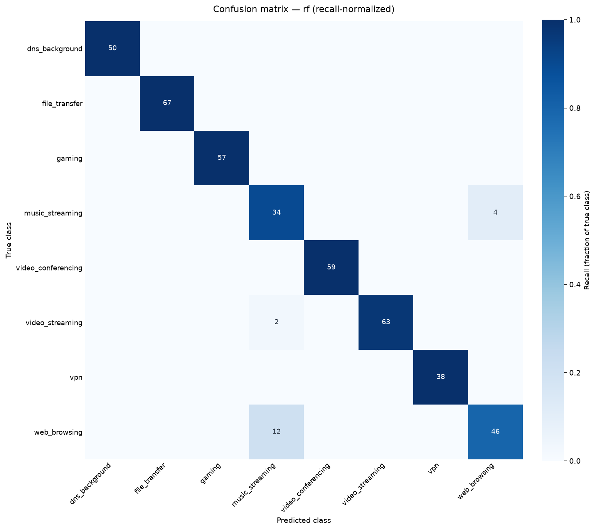

# Tiresias

**Real-time encrypted-traffic application classifier.** Tiresias labels network
*flows* by the application or service that generated them — video streaming, video
conferencing, web browsing, gaming, file transfer, music streaming, VPN, or
background/DNS chatter — using **only flow-level metadata**: packet-size sequences,
inter-arrival timing, byte ratios, and TLS ClientHello fields (SNI, JA3 fingerprint,
cipher/extension shape). **No payloads are inspected or decrypted.**

> Most traffic today is encrypted (TLS 1.3, QUIC), so classic deep-packet-inspection
> on payload content no longer works. The interesting question is how much you can
> infer from *metadata alone*. Tiresias is a research-style prototype exploring
> exactly that — not a production intrusion-detection system.

The blind seer Tiresias perceived truth without sight; this classifier infers
application identity without seeing (decrypting) payloads.

---

## ⚖️ Legal & ethical scope — read first

**Only capture traffic on networks and devices you own or control** — your own
laptop, your own home router, a personal lab VM. **Do not** capture on shared,
public, or employer networks. Network traffic is unavoidably sensitive even when
you can't read the payloads, so:

- Raw packet captures (`*.pcap`) and captured flow dumps are **never committed** to
  this repository (see `.gitignore`). Only code, small model artifacts, and
  evaluation reports/plots are versioned.
- The dataset is **self-generated**: you run each target application yourself and the
  capture agent auto-labels flows from the TLS SNI. Instructions for regenerating it
  are in the dataset docs — the raw data itself stays local.

---

## Architecture

```
                          ┌──────────────────────────────────────────────┐
                          │                  offline (train)             │
[pcap / live iface]       │  flows.parquet → features → RF/LightGBM →     │
        │                 │                    eval report + model.joblib │
        ▼                 └───────────────▲──────────────────────────────┘
 ┌──────────────┐   ┌─────────────────┐   │ shares feature order via
 │ Capture Agent│──▶│  Flow Assembler │   │ models.registry
 │  (scapy)     │   │ (5-tuple, aged) │   │
 └──────────────┘   └────────┬────────┘   │
                             │ flushed flows
                             ▼             │
                    ┌─────────────────┐    │
                    │ Feature Extract │────┘
                    │ (+TLS/JA3)      │
                    └────────┬────────┘
                             ▼
                    ┌─────────────────┐   ┌───────────────────┐   ┌──────────────────┐
                    │ Streaming Scorer│──▶│ FastAPI backend   │──▶│  React Dashboard │
                    │ (+anomaly flag) │   │ WebSocket + REST  │   │ table + BW chart │
                    └─────────────────┘   └───────────────────┘   └──────────────────┘
```

Every stage is exercised end-to-end by a **synthetic traffic generator**
(`tiresias.synth`), so the full pipeline — features, a trained model, live streaming,
the dashboard — runs and is tested *before* any real capture. Real captures then
replace the synthetic dataset to produce the headline evaluation numbers.

---

## Quickstart

```bash
python -m venv .venv && source .venv/bin/activate
pip install -e ".[dev]"          # add ",boost" for LightGBM, ",deep" for the CNN
pytest                            # full test suite runs on synthetic data, no root needed
ruff check .
```

### Capture privileges

Live capture needs raw-socket access. Either run capture scripts with `sudo`, or
grant the capability once:

```bash
sudo setcap cap_net_raw,cap_net_admin+eip "$(readlink -f .venv/bin/python)"
```

You can always develop and test **without** capture using the offline pcap/synthetic
paths.

---

## How to run

*(Filled in per sprint as the pipeline lands.)*

- **Capture flows to disk** — `tiresias-capture --iface <if> --seconds 60` (Sprint 1)
- **Build a synthetic dataset** — `tiresias-synth --sessions 40 --out data/synth` (Sprint 2)
- **Build a labeled dataset from captures** — `tiresias-build-dataset` (Sprint 2)
- **Train + evaluate the baseline** — `tiresias-train` (Sprint 3)
- **Run the live backend** — `tiresias-serve` (Sprint 4)
- **Run the dashboard** — `cd dashboard && npm install && npm run dev` (Sprint 5)

---

## Results

> The numbers below are on the **synthetic** demo dataset (`tiresias-synth`), which
> exists to exercise the full pipeline end-to-end. Replace it with your own captured
> sessions to produce the headline numbers you put on a resume — the code, split, and
> report are identical. Full report: [`reports/eval_baseline.md`](reports/eval_baseline.md).

Session-based 75/25 split, 8 classes, features = flow size/timing + TLS structure +
raw packet sequence (**SNI and JA3 identity excluded** — no leakage):

| Model | Accuracy | Macro F1 | Latency / flow (median) |
|-------|----------|----------|-------------------------|
| RandomForest (headline) | ~95.8% | ~0.95 | single-digit ms |
| LightGBM | ~96.1% | ~0.96 | ~2–3 ms |

Per-class metrics and a feature-group ablation (showing SNI/JA3 leakage handling) are
in the report. The model confuses `web_browsing` ↔ `music_streaming` most — both are
bursty, download-leaning TLS flows — while `gaming`, `vpn`, `dns_background`, and
`file_transfer` are near-perfectly separated.



---

## Project layout

| Path | What |
|------|------|
| `src/tiresias/capture/` | scapy capture agent (live iface or pcap file) |
| `src/tiresias/flows/`   | 5-tuple flow assembler with idle/active/cap flushing |
| `src/tiresias/features/`| flow feature extraction incl. TLS ClientHello / JA3 |
| `src/tiresias/models/`  | dataset build, training, and the shared predict registry |
| `src/tiresias/pipeline/`| streaming scorer + queue |
| `src/tiresias/api/`     | FastAPI WebSocket + REST backend |
| `src/tiresias/synth/`   | synthetic traffic generator (testing + demo) |
| `dashboard/`            | Vite + React live dashboard |
| `data/` `artifacts/` `reports/` | local data (gitignored), models, eval output |

See [`EXECUTION_PLAN.md`](EXECUTION_PLAN.md) for the sprint-by-sprint build plan.

## License

MIT.
